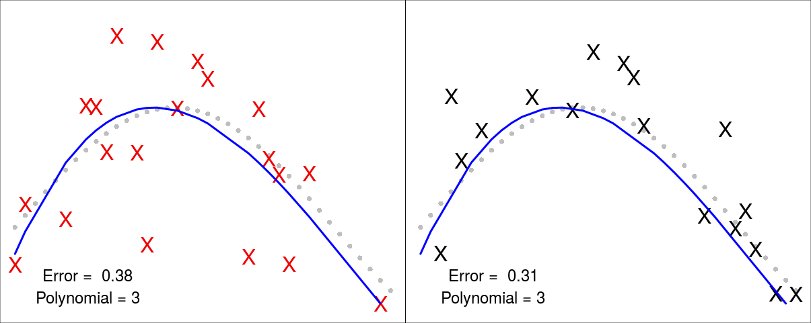
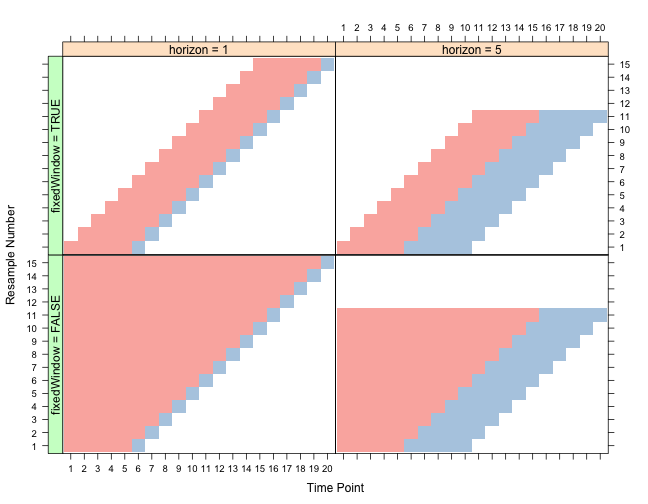

# Predictive Analytics in R
### David O'Brien <dunder.chief@gmail.com>
### August 25, 2015

--- 

<script src="http://ajax.googleapis.com/ajax/libs/jquery/1.9.1/jquery.min.js"></script>

<script>
$('ul.incremental li').addClass('fragment')
$('ol.incremental li').addClass('fragment')
</script>


What is Predictive Modeling?
-----------------------------------------------
<br> 

> 1. Given a set of **predictor variables (X)** 

> 2. Predict an **outcome (Y)**

<script> $('ol.incremental li').addClass('fragment')</script>

<aside class='notes'>

A simplified definition.

1. may not have an outcome Y
2. may want to know reasons behind __why__ X predicts Y

</aside>

---

Our Flower!
----------------------------------------------
<br>


---

What kind of iris is this?
---------------------------------


<br>


```{r, echo=FALSE, results='asis'}
library(knitr)
library(AppliedPredictiveModeling)
library(MASS)
makeShow <- function() {slidify('index.Rmd'); browseURL('index.html');}
frag_it <- function(xx) {
  sub('<table>', '<table class="fragment">', xx)
}
our_flower <- 55
ex_iris1 <- iris[our_flower, ]
ex_iris1$Species <- '???'
iris_names <- paste(gsub('\\.', ' ', colnames(iris)), 
                    c('[X1]','[X2]','[X3]','[X4]','[Y]'), sep='\n')
out <- kable(ex_iris1, row.names=FALSE, col.names=iris_names, align='c', 
             format='html')
#cat(sub('<table>', '<table class="fragment">', out))
```

---

Our guess: 
---------------------------------------------------------------------

```{r, echo=FALSE, results='asis'}
kable(ex_iris1, row.names=FALSE, col.names=iris_names, align='c', format='html')
```

```{r, echo=FALSE, results='asis'}
ex_iris2 <- rbind(iris[1:3, ], iris[51:53, ], iris[101:103, ])
out <- kable(data.frame(ex_iris2), row.names=FALSE, col.names=iris_names,
      align='c', format='html', padding=100)
#sub('<table>', '<table class="fragment" width="871" style="text-align: center;">', out)
frag_it(out)
```


.fragment  

```{r echo=FALSE, results='asis'}
fit <- lda(Species ~ ., iris[-our_flower, ])
pred <- t(predict(fit, iris[our_flower, ])$posterior)
colnames(pred) <- 'Probablity'
out <- kable(t(round(pred, 3)), format='html')
cat(sub('<table>', '<table class="fragment">', out))
```

<p style="color:red" class="fragment">Versicolor!</p>

<script>
$('ul.incremental li').addClass('fragment')
$('ol.incremental li').addClass('fragment')
</script>

--- 


Implementation in R: 
------------------------------------------
<br>
```{r}
library(MASS)
trainset <- iris[-our_flower, ] 
fit.lda <- lda(Species ~ ., data=trainset, prior=c(1/3, 1/3, 1/3)) 
pred <- predict(fit.lda, newdata=iris[our_flower, ])
round(pred$posterior, 3)
```

<br> 

<aside class='notes'>

Since most of the predictive modeling packages are written by different people,
they often have different option names/ input structure

</aside>

<script>
$('ul.incremental li').addClass('fragment')
$('ol.incremental li').addClass('fragment')
</script>

---

Machine Learning Basics
---------------------------------------------------
<br>
<br>

```{r}
library(caret)
trainIndex <- createDataPartition(iris$Species, p = .5,
                                  list = FALSE,
                                  times = 1)
irisTrain <- iris[ trainIndex, ]
irisTest  <- iris[-trainIndex, ]
```

<br>


<aside class='notes'>

__Why split data?__ To avoid overfitting our results

__Example:__ This is a good example of how caret make you do things the right way. I would normally just select random rows instead of breaking down into equal classes.

</aside>

---

Model Tuning
---------------------------------------------------
__$$y = \sin(2x)$$__
```{r, echo=TRUE, eval=TRUE, fig.height=2}
x <- seq(pi, 5, by=.05)
y <- sin(2*x)
```

```{r, echo=FALSE, fig.height=2}
par(mar=c(0,0,0,0))
plot(y ~ x, pch=16)
```


```{r, fig.height=2}
set.seed(1)
error <- rnorm(length(x), sd=.5)
dat <- data.frame(X = x , Y = y + error)
```

```{r, echo=FALSE, fig.height=2}
par(mar=c(0,0,0,0))
plot(y ~ x, pch=16, col='gray')
points(Y ~ X, data=dat, pch='X', col='red2')
```

<aside class='notes'>

1. Create data where we know the optimal fit

2. Add some randomness to it

</aside>

---

Tuning polynomials
------------------------------------------------

```{r}
set.seed(100)
trainIndex <- createDataPartition(y=dat$Y, p=0.5, list=FALSE)

training <- dat[trainIndex, ]
test <- dat[-trainIndex, ]
```

<br> 

$$y=\theta_3x^3 + \theta_2x^2 + \theta_1x + \theta_0$$

<br>

```{r, eval=FALSE}
fit <- lm(Y ~ poly(X, 3, raw=TRUE), data=training)
pred.training <- predict(fit, newdata=training)
pred.test <- predict(fit, newdata=test)
```


<aside class='notes'>

We always fit on the training set

But we will compare analyzing this tuning parameter on both the training & test sets

</aside>

---

In-sample (__training set__)   |   Out-of-sample (__test set__)

```{r, echo=FALSE, eval=FALSE, fig.height=2, warning=FALSE, message=FALSE}
polyPlot <- function(training, test, pol, color, return_err) {
  par(mar=c(0,0,0,0))
  plot(x, y, pch=16, col='gray',yaxt='n', xaxt='n', ann=FALSE, ylim=c(-.7, 1.8))
  points(Y ~ X, data=test, pch='X', col=color, cex=2)
  fit <- lm(Y ~ poly(X, pol, raw=TRUE), data=training)
  pred <- predict(fit, newdata=test)
  lines(training$X[order(training$X)], fit$fitted.values[order(training$X)], col='blue', lwd=4)
  error <- mean(abs(test$Y - pred))
  text(3.5, -.4, paste('Error = ', round(error,2)), cex=1.5)
  text(3.5, -.6, paste('Polynomial =', pol), cex=1.5)
  if(return_err) {return(error)} 
}
par(mfrow=c(1,2), mar=rep(0,4))
polyPlot(training, training, 1,  'red2', FALSE)
polyPlot(training, test, 1, 'black', FALSE)

polyPlot(training, training, 3,  'red2', FALSE)
polyPlot(training, test, 3, 'black', FALSE)

polyPlot(training, training, 9,  'red2', FALSE)
polyPlot(training, test, 9, 'black', FALSE)

polyPlot(training, training, 50,  'red2', FALSE)
polyPlot(training, test, 50, 'black', FALSE)

err <- foreach(poly=1:50, .combine=rbind) %do% {
  data.frame(
    train.err= polyPlot(training, training, poly,  'red2', TRUE),
    test.err = polyPlot(training, test, poly, 'black', TRUE)
  )
}

par(mar=rep(2, 4), mfrow=c(2,1))
plot(1:10, err$test.err[1:10], col='red3', xlab='polynomial', ylab='Error', type='l', lwd=4)
plot(1:50, err$train.err[1:50], col='gray', type='l', lwd=4)
```
 

 

<aside class='notes'>

Error only decreases in training set

At polynomial = 50. Our model no longer works on new data

</aside>

---


<aside class='notes'>
error: lower is better. grey line is our training error. Test is red

training error will always go down as the model gets more flexible

but we want to know how well it does on new data

test set is a better reflection of this

</aside>

---

Parsimony / Occam's Razor
---------------------------------------------------

The simplest model is usually the best. 
<br>


---


Data Splitting 
---------------------------------------------------

<br>

>  1. __Training set [60%]:__ <br> Train a model 100x with different tuning parameters <br><br>
>  2. __Cross-validation set [20%]:__ <br> Evaluate these 100 models <br><br>
>  3. __Test set [20%]:__ <br> Use final model __(only one!)__ to evaluate your the accuracy of your analysis

<script>
$('ul.incremental li').addClass('fragment')
$('ol.incremental li').addClass('fragment')
</script>

<aside class='notes'>

1. Most ML models have tuning parameters & we need to optimize these useing an out of sample dataset

2. This is our out of sample set for evaluating these params

3. In order to avoid overfitting due to tuning param selection, need a fresh test set
example of this is on prev slide

</aside>

---

40% of data on testing?!?
--------------------------------------

<br>


---

k-fold cross-validation
--------------------------------------
<br>


<aside class='notes'>

in this case we have 5-fold cross-validation

For each parametor 1:100, we get 5-error metrics, we average these to find our best model

Then we use this model on the test set (keep 80% of data)

</aside>


--- 


Typical flow for trying a new algorithm:
--------------------------------------------------------------

1. Find the package(s) and install
2. Find training function 
3. Split data into multiple train/test sets
4. Set up your data to fit the training model
    - Formula
    - Matrix
    - Data.frame
    - X, Y as seperate objects
5. Pre-process data
6. Look up tuning params
7. Write loops for model tuning / repeated cross-validation
8. Analyze results

<aside class='notes'>

Typical flow for base r

__Data Inputs:__ <br> formula, data.frame, matrix, or seperate X & Y objects 
in caret all of this is contained in less than 5 lines of code

</aside>


---

predict(fitObject, type = __???__)
---------------------------------------------

<br>

```{r, echo=FALSE, results='asis'}
out <- kable(
  data.frame(Model=c('gbm', 'mda', 'rpart', 'Weka', 'LogitBoost', 'lda'),
             Probability=c('"response"', '"posterior"', '"prob"', 
                           '"probability"', '"raw"','None needed' )), 
  format='html'
)
cat(sub('<table>', 
        '<table class="fragment" style="font-size: 40px; line-height: 50px;">', out))
```


<aside class='notes'>

There is some standardization, such as the predict function to test our model on a new datasets

</aside>

---


Caret
-----------------------------

Website: <https://topepo.github.io/caret/index.html>

List of Models: <https://topepo.github.io/caret/modelList.html>

<br>

```{r, class="Fragment"}
options(stringsAsFactors=FALSE)
models <- read.csv('../caret_models.csv')
table(models$Type)
class_models <- subset(models, Type %in% c('Classification', 'Dual Use'),
                       select='method.Argument')
```

<script>
$('ul.incremental li').addClass('fragment')
$('ol.incremental li').addClass('fragment')
</script>

<aside class='notes'>

Wrapper for 192 models

91 Machine learning packages

With all these dependencies, probably a few thousand packages in total???

Can add your own

</aside>

---

Train lots of models at once
---------------------------------------

<br>

```{r caretStart, class="fragment", eval=FALSE}
library(caret); library(doMC); registerDoMC(7)
myFits <- foreach(this.model = class_models) %do% {
  train(Species ~ ., 
        data=iris,
        method=this.model,
        preProcess='pca',
        trControl=trainControl(method='repeatedcv', number=5, repeats=7),
        tuneLength=5)
}
```

<script>
$('ul.incremental li').addClass('fragment')
$('ol.incremental li').addClass('fragment')
</script>

<br>

<aside class='notes'>

This will:
1. preprocess with PCA,

2. train with 5-fold cross validation, 7 repeats in parallel

3. will also optimize tuning parameters

Took XX minutes to run

Not all models worked because we have 3 categories


</aside>


---


<br>


---


caret: Basic Syntax
--------------------------------------

```
train(Species ~ ., 
        data=iris,
        method='gbm',
        preProcess='knnImpute',
        trControl=trainControl(method='repeatedcv', number=5, repeats=7),
        tuneLength=5)
```


---

train():
----------------------------------------

>- method: _our machine learning algorithm (select from 192)_
>- preProcess: 

```{r, echo=FALSE, results='asis'}

out <- data.frame(PreProcess_Option=c("BoxCox", "YeoJohnson", "expoTrans", "center", "scale", "range", "knnImpute", "bagImpute", "medianImpute", "pca", "ica", "spatialSign"))

frag_it(kable(out, format='html'))
```

---

trainControl():
----------------------------------------

```{r, echo=FALSE}
out <- data.frame(Resampling_Method=c("boot", "boot632", "cv", "repeatedcv", "LOOCV", "LGOCV", "none", "oob", "adaptive_cv", "adaptive_boot", "adaptive_LGOCV"))
kable(out, format='html')
```


---

Adding custom tuning params
----------------------------------------

```{r}
gbmGrid <-  expand.grid(interaction.depth = c(1, 5, 9),
                        n.trees = (1:30)*50,
                        shrinkage = 0.1,
                        n.minobsinnode = 20)
head(gbmGrid)
```

```{r, eval=FALSE}
train(Species ~ ., 
      data=iris,
      method='gbm',
      preProcess='pca',
      trControl=trainControl(method='repeatedcv', number=5, repeats=7),
      tuneGrid = gbmGrid)
```   


---

Adaptive Resampling
---------------------------------------

Speed up the optimazion process

```{r, eval=FALSE}
fitControl2 <- trainControl(method = "adaptive_cv",
                            number = 10,
                            repeats = 5,
                            ## Estimate class probabilities
                            classProbs = TRUE,
                            ## Evaluate performance using 
                            ## the following function
                            summaryFunction = twoClassSummary,
                            ## Adaptive resampling information:
                            adaptive = list(min = 10,
                                            alpha = 0.05,
                                            method = "gls",
                                            complete = TRUE))
```


ref: http://arxiv.org/abs/1405.6974

---


What else can caret do?
---------------------------------------

<br>

> - Data Splitting

> - Pre-processing

> - Feature Selection 

> - Model tuning / Resampling

> - Variable Importance

<script>
$('ul.incremental li').addClass('fragment')
$('ol.incremental li').addClass('fragment')
</script>

<aside class='notes'>

Easier to use than base R

Prevents common mistakes

</aside>

---

Data Splitting (Time Series)
---------------------------------------------------

<br>



```{r, echo=FALSE, message=FALSE}
## Save to file in case I need to compile at presentation without internet 
library(quantmod)
# gold <- getSymbols('GLD', src='yahoo', from='1970-01-01', auto.assign=F)
# saveRDS(gold, '../gold_ts.rds')
gold <- readRDS('../gold_ts.rds')
```


<aside class='notes'>

Time series can't be split randomly because the slice we're predicting depends on the previous samples.

</aside>

---

Time Series
-------------------------------------------------------

```{r, eval=FALSE, class="fragment"}
library(quantmod)
gold <- getSymbols('GLD', src='yahoo', from='1970-01-01', auto.assign=FALSE)
```

```{r}
library(caret)
slices <- createTimeSlices(Cl(gold), initialWindow=1000, 
                           fixedWindow=TRUE, horizon=500, skip=500)
str(slices)
```

---

Data Splitting | Class imbalances
---------------------------------------------------

```{r}
imbal_train <- twoClassSim(10000, intercept = -20, linearVars = 20)
imbal_test  <- twoClassSim(10000, intercept = -20, linearVars = 20)
table(imbal_train$Class)
```

```{r, eval=FALSE}
upSample()
downSample()
ROSE()
SMOTE()
```

http://topepo.github.io/caret/sampling.html

<aside class='notes'>

Never balance the test set

</aside>

---

Pre-processing
---------------------------------------------------

<br>

```{r, eval=FALSE}
dummyVars()

nearZeroVar()

findCorrelation()

findLinearCombos()

classDist()
```
<aside class='notes'>

The list goes into 

1. Center and scale so mean is 0 for all predictors with a STDEV of 1
2. Dimensionality reduction

why caret:
Makes you do it right by default, I kept doing it wrong at first.
Applies same parameters to the test set.

Go through example...

Imputation???

</aside>

---

Variable Importance
----------------------------------------------------

<br>
<br>

```{r, eval=FALSE}
varImp()
```

<aside class='notes'>

What
__A way to rank our predictors by how important they are to the model__

Why
__Help us remove predictors we don't want. And give us an idea about what causes our outcome variable__

How
__Examples__


</aside>

---

Feature Selection
---------------------------------------------------


<aside class='notes'>

What is feature selection? 
__this is a subset of the features that we will need__


Why we need it:
__Can be challenging with many predictors & we can't try every possible model__

How to do it:
__method 1, 2, 3, etc.....__

</aside>


---

Recursive Feature Elimination:
```{r, eval=FALSE}
rfe() 
rfeControl()
```
Genetic Algorithms:
```{r, eval=FALSE}
gafs()
gafsControl()
```

Univariate Filters:
```{r, eval=FALSE}
sbf()
sbfControl()
```
Simalated Annealing:
```{r, eval=FALSE}
safs()
safsControl()
```

<aside class='notes'>

UnivariateFilters = Uses statistics, like t-tests or anovas, to determine whether a feature is statistically different between Outcome Classes

rfe = backward/forward feat selection

GA = mimic darwinism where the best models have 'offspring' that are combined in the next iteration.

SA =

</aside>

---


<!------------------H2O-------------------------------------->

h2o package:
---------------------------------------------------------------------

http://h2o.ai/

- Open Source Java library

- Runs Single model over multiple nodes

- Hadoop & Spark

- EC2 / Azure / Compute ENgine

- R, Scala, Python, Web Browser, REST API

- Run locally

<aside class='notes'>

Most of machine learning is subject to 'riduculously parallelization' because of optimization steps during training

But for really large data where params are already estimated, you
may want to parallelize a siCan be challenging with many predictors & we can'ngle model.

</aside>

---

Models available with H2O
-------------------------------------------------------------

<br>

- K-Means
- GLM
- DRF
- Naïve Bayes
- PCA
- GBM
- Deep Learning

<aside class='notes'>

</aside>

---

```{r, eval=FALSE}
h2o.deeplearning(
   x, y, training_frame, model_id = "",
   overwrite_with_best_model, 
   validation_frame, checkpoint,
   autoencoder = FALSE, 
   use_all_factor_levels = TRUE,
   activation = c("Rectifier", "Tanh", "TanhWithDropout",
   "RectifierWithDropout", "Maxout", "MaxoutWithDropout"), 
   hidden = c(200, 200), 
   epochs = 10, 
   train_samples_per_iteration = -2, 
   seed, 
   adaptive_rate=TRUE, 
   rho = 0.99, 
   epsilon = 1e-08, 
   rate = 0.005,
   rate_annealing = 1e-06, 
   rate_decay = 1, 
   momentum_start=0,
   momentum_ramp = 1e+06, 
   momentum_stable = 0,
   nesterov_accelerated_gradient = TRUE, 
   input_dropout_ratio=0, 
   hidden_dropout_ratios, 
   l1 = 0, l2 = 0, max_w2 = Inf,
   initial_weight_distribution=c("UniformAdaptive",
                                 "Uniform","Normal"),
   initial_weight_scale = 1, 
   loss = c("Automatic", "CrossEntropy", "MeanSquare", 
            "Absolute", "Huber"), 
   distribution = c("AUTO", "gaussian", "bernoulli", 
                    "multinomial", "poisson", "gamma", 
                    "tweedie", "laplace","huber"), 
   tweedie_power = 1.5, 
   score_interval = 5, 
   score_training_samples,
   score_validation_samples, 
   score_duty_cycle, 
   classification_stop,
   regression_stop, 
   quiet_mode, 
   max_confusion_matrix_size, 
   max_hit_ratio_k,
   balance_classes = FALSE, 
   class_sampling_factors, 
   max_after_balance_size,
   score_validation_sampling, 
   diagnostics, 
   variable_importances, 
   fast_mode, 
   ignore_const_cols,  
   force_load_balance, 
   replicate_training_data, 
   single_node_mode, 
   shuffle_training_data, 
   sparse, col_major,
   average_activation, 
   sparsity_beta, 
   max_categorical_features,
   reproducible = FALSE, 
   export_weights_and_biases = FALSE,
   offset_column = NULL, 
   weights_column = NULL, 
   nfolds = 0,
   fold_column = NULL, 
   fold_assignment = c("AUTO", "Random", "Modulo"),
   keep_cross_validation_predictions = FALSE, ...)
```

---

Use case
-------------------------------------------------------------

```{r, eval=FALSE, echo=FALSE}
library(h2o); library(caret)
trainIndex <- createDataPartition(iris$Species, p=.75, list=FALSE)
iris.train <- iris[trainIndex, ]
iris.test <- iris[-trainIndex, ]
```

```{r, eval=FALSE}
library(h2o)
# Initialize h2o with nthreads (default is 2)
localH2O <- h2o.init(nthreads = 4)
# Convert our datasets
iris.train.h2o <- as.h2o(iris.train, localH2O)
iris.test.h2o <- as.h2o(iris.test, localH2O)

# Run the model
model = h2o.deeplearning(x = colnames(iris)[-ncol(iris)],
                         y = "Species",
                         training_frame = iris.train.h2o,
                         activation = "Tanh",
                         hidden = c(10, 10, 10),
                         epochs = 10000)

# Check performance of test set
performance = h2o.performance(model = model, data=iris.test.h2o)
```

<aside class='notes'>

</aside>


---

<!----------------GPU--------------------------------------->
GPU computing for machine learning in R
-------------------------------------------------------------

__Packages:__

- gputools
- rpud

<aside class='notes'>
A typical machine will have 4-8 cores

A GPU can have 1000 cores

All depend on CUDA infastructure (check this!)

OpenMP????
</aside>

---

gputools
--------------------------------------------------------------

```{r, eval=FALSE}
gpuGLM()
gpuLM()
gpuHclust(gpuDist())
```

<aside class='notes'>

Many more mathmatic functions

</aside>

---


rpud
--------------------------------------------------------------

http://www.r-tutor.com/gpu-computing

```{r, eval=FALSE}
rpuHclust()
rvbm()
rhierLinearModel()
rpusvm()
```

<aside class='notes'>

rhierLinearModel() = Hierarchical Linear Model
rvbm() = Bayesian Classification with Gaussian Process

</aside>

---

<!-------------------THE END---------------------------------->

Places to Learn all about machine learning
---------------------------------------------------------------

- Andrew Ng, Coursera/Stanford   https://www.coursera.org/learn/machine-learning
- Trevor Hastie, Rob Tibirashi Statistical Learning  http://online.stanford.edu/course/statistical-learning-winter-2014
- JHU Practical Machine Learning   https://www.coursera.org/course/predmachlearn
- Georgia Tech / Udacity M.S. in comp. sci.  <br> http://www.omscs.gatech.edu/

---

Good reads
---------------------------------------------------------------

<br>

  

