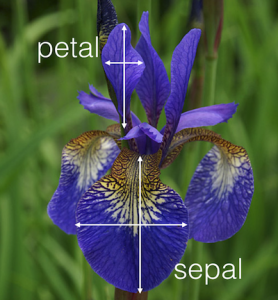

# Predictive Analytics in R
### David O'Brien <dunder.chief@gmail.com>
### August 25, 2015

--- 

<script src="http://ajax.googleapis.com/ajax/libs/jquery/1.9.1/jquery.min.js"></script>

<script>
$('ul.incremental li').addClass('fragment')
$('ol.incremental li').addClass('fragment')
</script>


What is Predictive Modeling?
-----------------------------------------------
<br> 

> 1. Given a set of **predictor variables (X)** 

> 2. Predict an **outcome (Y)**

<script> $('ol.incremental li').addClass('fragment')</script>

---

Our Flower!
----------------------------------------------
<br>
<div class='centered'>
  
</div>


---

What kind of iris is this?
---------------------------------


<br>

<table class="fragment">
 <thead>
  <tr>
   <th style="text-align:center;"> Sepal Length
[X1] </th>
   <th style="text-align:center;"> Sepal Width
[X2] </th>
   <th style="text-align:center;"> Petal Length
[X3] </th>
   <th style="text-align:center;"> Petal Width
[X4] </th>
   <th style="text-align:center;"> Species
[Y] </th>
  </tr>
 </thead>
<tbody>
  <tr>
   <td style="text-align:center;"> 6.5 </td>
   <td style="text-align:center;"> 2.8 </td>
   <td style="text-align:center;"> 4.6 </td>
   <td style="text-align:center;"> 1.5 </td>
   <td style="text-align:center;"> ??? </td>
  </tr>
</tbody>
</table>

---

Our guess: 
---------------------------------------------------------------------

<table>
 <thead>
  <tr>
   <th style="text-align:center;"> Sepal Length
[X1] </th>
   <th style="text-align:center;"> Sepal Width
[X2] </th>
   <th style="text-align:center;"> Petal Length
[X3] </th>
   <th style="text-align:center;"> Petal Width
[X4] </th>
   <th style="text-align:center;"> Species
[Y] </th>
  </tr>
 </thead>
<tbody>
  <tr>
   <td style="text-align:center;"> 6.5 </td>
   <td style="text-align:center;"> 2.8 </td>
   <td style="text-align:center;"> 4.6 </td>
   <td style="text-align:center;"> 1.5 </td>
   <td style="text-align:center;"> ??? </td>
  </tr>
</tbody>
</table>


.fragment 


<table class="fragment"> 
  <thead>
  <tr>
   <th style="text-align:left;">   </th>
   <th style="text-align:center;"> Probability </th>
  </tr>
 </thead>
<tbody>
  <tr>
   <td style="text-align:left;"> setosa </td>
   <td style="text-align:center;"> 0.000 </td>
  </tr>
  <tr>
   <td style="text-align:left;"> versicolor </td>
   <td style="text-align:center;"> 0.995 </td>
  </tr>
  <tr>
   <td style="text-align:left;"> virginica </td>
   <td style="text-align:center;"> 0.005 </td>
  </tr>
</tbody>
</table>

<br>

.fragment Answer = <p style="color:red" class="fragment">Versicolor</p>

<script>
$('ul.incremental li').addClass('fragment')
$('ol.incremental li').addClass('fragment')
</script>

--- 

How do we estimate these parameters: 
-----------------------------

<table>
 <thead>
  <tr>
   <th style="text-align:center;"> Sepal Length
[X1] </th>
   <th style="text-align:center;"> Sepal Width
[X2] </th>
   <th style="text-align:center;"> Petal Length
[X3] </th>
   <th style="text-align:center;"> Petal Width
[X4] </th>
   <th style="text-align:center;"> Species
[Y] </th>
  </tr>
 </thead>
<tbody>
  <tr>
   <td style="text-align:center;"> 5.1 </td>
   <td style="text-align:center;"> 3.5 </td>
   <td style="text-align:center;"> 1.4 </td>
   <td style="text-align:center;"> 0.2 </td>
   <td style="text-align:center;"> setosa </td>
  </tr>
  <tr>
   <td style="text-align:center;"> 4.9 </td>
   <td style="text-align:center;"> 3.0 </td>
   <td style="text-align:center;"> 1.4 </td>
   <td style="text-align:center;"> 0.2 </td>
   <td style="text-align:center;"> setosa </td>
  </tr>
  <tr>
   <td style="text-align:center;"> 7.0 </td>
   <td style="text-align:center;"> 3.2 </td>
   <td style="text-align:center;"> 4.7 </td>
   <td style="text-align:center;"> 1.4 </td>
   <td style="text-align:center;"> versicolor </td>
  </tr>
  <tr>
   <td style="text-align:center;"> 6.4 </td>
   <td style="text-align:center;"> 3.2 </td>
   <td style="text-align:center;"> 4.5 </td>
   <td style="text-align:center;"> 1.5 </td>
   <td style="text-align:center;"> versicolor </td>
  </tr>
  <tr>
   <td style="text-align:center;"> 6.3 </td>
   <td style="text-align:center;"> 3.3 </td>
   <td style="text-align:center;"> 6.0 </td>
   <td style="text-align:center;"> 2.5 </td>
   <td style="text-align:center;"> virginica </td>
  </tr>
  <tr>
   <td style="text-align:center;"> 5.8 </td>
   <td style="text-align:center;"> 2.7 </td>
   <td style="text-align:center;"> 5.1 </td>
   <td style="text-align:center;"> 1.9 </td>
   <td style="text-align:center;"> virginica </td>
  </tr>
</tbody>
</table>

Use this _historical_ data to optimize the best fit for our future models:

We use this dataset to find:

1. Mean for each measurements for each class
2. 
3. 

--- 


Implementation in R: 
------------------------------------------
<br>

```r
library(MASS)
trainset <- iris[-example_row, ] 
fit.lda <- lda(Species ~ ., data=trainset, prior=c(1/3, 1/3, 1/3)) 
pred <- predict(fit.lda, iris[example_row, ])
round(pred$posterior, 3)
```

```
##    setosa versicolor virginica
## 55      0      0.995     0.005
```

<br> 

__Inputs:__

- formula
- data.frame
- matrix
- X, Y

<aside class='notes'>

Since most of the predictive modeling packages are written by different people,
they often have different option names/ input structure

</aside>

--- 


<p font-family:"Inconsolata">predict(fit_obj, type=???)</p>


<br>

<table class=fragment>
 <thead>
  <tr>
   <th style="text-align:left;"> Model </th>
   <th style="text-align:left;"> Probability </th>
  </tr>
 </thead>
<tbody>
  <tr>
   <td style="text-align:left;"> lda </td>
   <td style="text-align:left;"> None needed </td>
  </tr>
  <tr>
   <td style="text-align:left;"> gbm </td>
   <td style="text-align:left;"> response </td>
  </tr>
  <tr>
   <td style="text-align:left;"> mda </td>
   <td style="text-align:left;"> posterior </td>
  </tr>
  <tr>
   <td style="text-align:left;"> rpart </td>
   <td style="text-align:left;"> prob </td>
  </tr>
  <tr>
   <td style="text-align:left;"> Weka </td>
   <td style="text-align:left;"> probability </td>
  </tr>
  <tr>
   <td style="text-align:left;"> LogitBoost </td>
   <td style="text-align:left;"> raw </td>
  </tr>
</tbody>
</table>


<aside class='notes'>

There is some standardization, such as the predict function to test our model on a new datasets
</aside>

