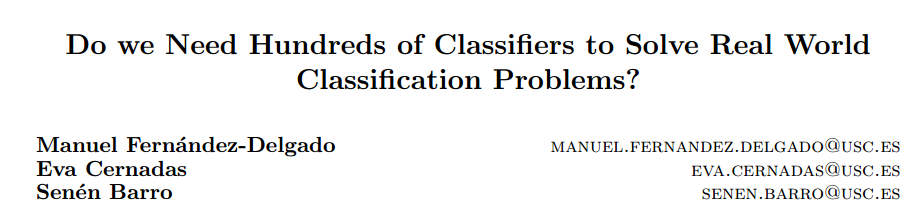

# Predictive Analytics in R
### David O'Brien <dunder.chief@gmail.com>
### August 25, 2015

--- 

<script src="http://ajax.googleapis.com/ajax/libs/jquery/1.9.1/jquery.min.js"></script>

<script>
$('ul.incremental li').addClass('fragment')
$('ol.incremental li').addClass('fragment')
</script>


What is Predictive Modeling?
-----------------------------------------------
<br> 

> 1. Given a set of **predictor variables (X)** 

> 2. Predict an **outcome (Y)**

<script> $('ol.incremental li').addClass('fragment')</script>

<aside class='notes'>

A simplified definition.

1. may not have an outcome Y
2. may want to know reasons behind __why__ X predicts Y

</aside>

---

Our Flower!
----------------------------------------------
<br>


---

What kind of iris is this?
---------------------------------


<br>


---

Our guess: 
---------------------------------------------------------------------

<table>
 <thead>
  <tr>
   <th style="text-align:center;"> Sepal Length
[X1] </th>
   <th style="text-align:center;"> Sepal Width
[X2] </th>
   <th style="text-align:center;"> Petal Length
[X3] </th>
   <th style="text-align:center;"> Petal Width
[X4] </th>
   <th style="text-align:center;"> Species
[Y] </th>
  </tr>
 </thead>
<tbody>
  <tr>
   <td style="text-align:center;"> 6.5 </td>
   <td style="text-align:center;"> 2.8 </td>
   <td style="text-align:center;"> 4.6 </td>
   <td style="text-align:center;"> 1.5 </td>
   <td style="text-align:center;"> ??? </td>
  </tr>
</tbody>
</table>


.fragment 


<table class="fragment">
 <thead>
  <tr>
   <th style="text-align:left;">   </th>
   <th style="text-align:right;"> Probablity </th>
  </tr>
 </thead>
<tbody>
  <tr>
   <td style="text-align:left;"> setosa </td>
   <td style="text-align:right;"> 0.000 </td>
  </tr>
  <tr>
   <td style="text-align:left;"> versicolor </td>
   <td style="text-align:right;"> 0.995 </td>
  </tr>
  <tr>
   <td style="text-align:left;"> virginica </td>
   <td style="text-align:right;"> 0.005 </td>
  </tr>
</tbody>
</table>

<p style="color:red" class="fragment">Versicolor!</p>

<script>
$('ul.incremental li').addClass('fragment')
$('ol.incremental li').addClass('fragment')
</script>

--- 

How do we estimate these parameters: 
-----------------------------

<br>

<br>
<table class="fragment">
 <thead>
  <tr>
   <th style="text-align:center;"> Sepal Length
[X1] </th>
   <th style="text-align:center;"> Sepal Width
[X2] </th>
   <th style="text-align:center;"> Petal Length
[X3] </th>
   <th style="text-align:center;"> Petal Width
[X4] </th>
   <th style="text-align:center;"> Species
[Y] </th>
  </tr>
 </thead>
<tbody>
  <tr>
   <td style="text-align:center;"> 5.1 </td>
   <td style="text-align:center;"> 3.5 </td>
   <td style="text-align:center;"> 1.4 </td>
   <td style="text-align:center;"> 0.2 </td>
   <td style="text-align:center;"> setosa </td>
  </tr>
  <tr>
   <td style="text-align:center;"> 4.9 </td>
   <td style="text-align:center;"> 3.0 </td>
   <td style="text-align:center;"> 1.4 </td>
   <td style="text-align:center;"> 0.2 </td>
   <td style="text-align:center;"> setosa </td>
  </tr>
  <tr>
   <td style="text-align:center;"> 4.7 </td>
   <td style="text-align:center;"> 3.2 </td>
   <td style="text-align:center;"> 1.3 </td>
   <td style="text-align:center;"> 0.2 </td>
   <td style="text-align:center;"> setosa </td>
  </tr>
  <tr>
   <td style="text-align:center;"> 7.0 </td>
   <td style="text-align:center;"> 3.2 </td>
   <td style="text-align:center;"> 4.7 </td>
   <td style="text-align:center;"> 1.4 </td>
   <td style="text-align:center;"> versicolor </td>
  </tr>
  <tr>
   <td style="text-align:center;"> 6.4 </td>
   <td style="text-align:center;"> 3.2 </td>
   <td style="text-align:center;"> 4.5 </td>
   <td style="text-align:center;"> 1.5 </td>
   <td style="text-align:center;"> versicolor </td>
  </tr>
  <tr>
   <td style="text-align:center;"> 6.9 </td>
   <td style="text-align:center;"> 3.1 </td>
   <td style="text-align:center;"> 4.9 </td>
   <td style="text-align:center;"> 1.5 </td>
   <td style="text-align:center;"> versicolor </td>
  </tr>
  <tr>
   <td style="text-align:center;"> 6.3 </td>
   <td style="text-align:center;"> 3.3 </td>
   <td style="text-align:center;"> 6.0 </td>
   <td style="text-align:center;"> 2.5 </td>
   <td style="text-align:center;"> virginica </td>
  </tr>
  <tr>
   <td style="text-align:center;"> 5.8 </td>
   <td style="text-align:center;"> 2.7 </td>
   <td style="text-align:center;"> 5.1 </td>
   <td style="text-align:center;"> 1.9 </td>
   <td style="text-align:center;"> virginica </td>
  </tr>
  <tr>
   <td style="text-align:center;"> 7.1 </td>
   <td style="text-align:center;"> 3.0 </td>
   <td style="text-align:center;"> 5.9 </td>
   <td style="text-align:center;"> 2.1 </td>
   <td style="text-align:center;"> virginica </td>
  </tr>
</tbody>
</table>

--- 


Implementation in R: 
------------------------------------------
<br>

```r
library(MASS)
trainset <- iris[-example_row, ] 
fit.lda <- lda(Species ~ ., data=trainset, prior=c(1/3, 1/3, 1/3)) 
pred <- predict(fit.lda, newdata=iris[example_row, ])
round(pred$posterior, 3)
```

```
##    setosa versicolor virginica
## 55      0      0.995     0.005
```

<br> 

.fragment __Data Inputs:__ <br> formula, data.frame, matrix, or seperate X & Y objects 

<aside class='notes'>

Since most of the predictive modeling packages are written by different people,
they often have different option names/ input structure

</aside>

<script>
$('ul.incremental li').addClass('fragment')
$('ol.incremental li').addClass('fragment')
</script>


--- 


predict(fitObject, type = __???__)
---------------------------------------------

<br>

<table class="fragment" style="font-size: 40px; line-height: 50px;">
 <thead>
  <tr>
   <th style="text-align:left;"> Model </th>
   <th style="text-align:left;"> Probability </th>
  </tr>
 </thead>
<tbody>
  <tr>
   <td style="text-align:left;"> gbm </td>
   <td style="text-align:left;"> &quot;response&quot; </td>
  </tr>
  <tr>
   <td style="text-align:left;"> mda </td>
   <td style="text-align:left;"> &quot;posterior&quot; </td>
  </tr>
  <tr>
   <td style="text-align:left;"> rpart </td>
   <td style="text-align:left;"> &quot;prob&quot; </td>
  </tr>
  <tr>
   <td style="text-align:left;"> Weka </td>
   <td style="text-align:left;"> &quot;probability&quot; </td>
  </tr>
  <tr>
   <td style="text-align:left;"> LogitBoost </td>
   <td style="text-align:left;"> &quot;raw&quot; </td>
  </tr>
  <tr>
   <td style="text-align:left;"> lda </td>
   <td style="text-align:left;"> None needed </td>
  </tr>
</tbody>
</table>


<aside class='notes'>

There is some standardization, such as the predict function to test our model on a new datasets

</aside>

---

Typical flow for trying a new algorithm:
--------------------------------------------------------------

1. Find the package(s) and install
2. Find training function 
3. Split data into multiple train/test sets
4. Set up your data to fit the training model
    - Formula
    - Matrix
    - Data.frame
    - X, Y as seperate
5. Pre-process data
6. Look up tuning params
7. Write loops for model tuning / repeated cross-validation
8. Analyze results

<aside class='notes'>

Typical flow for base r

in caret all of this is contained in less than 5 lines of code

</aside>


---

Caret
-----------------------------

Website: <https://topepo.github.io/caret/index.html>
List of Models: <https://topepo.github.io/caret/modelList.html>

<br>


```r
options(stringsAsFactors=FALSE)
models <- read.csv('../caret_models.csv')
table(models$Type)
```

```
## 
## Classification       Dual Use     Regression 
##             74             73             45
```

```r
class_models <- subset(models, Type %in% c('Classification', 'Dual Use'),
                       select='method.Argument')
```

<script>
$('ul.incremental li').addClass('fragment')
$('ol.incremental li').addClass('fragment')
</script>

<aside class='notes'>

91 Machine learning packages

With all these dependencies, probably a few thousand packages in total???

</aside>

---

Train lots of models at once
---------------------------------------

<br>


```r
library(caret); library(doMC); registerDoMC(7)
myFits <- foreach(this.model = class_models) %do% {
  train(Species ~ ., 
        data=iris,
        method=this.model,
        preProcess='pca',
        trControl=trainControl(method='repeatedcv', number=5, repeats=7),
        tuneLength=5)
}
```

<script>
$('ul.incremental li').addClass('fragment')
$('ol.incremental li').addClass('fragment')
</script>

<br>

<aside class='notes'>

This will:
1. preprocess with PCA,
2. train with 5-fold cross validation, 7 repeats in parallel
3. will also optimize tuning parameters

Took XX minutes to run

Not all models worked because we have 3 categories


</aside>

---



<br>


---

What else can caret do?
---------------------------------------

<br>

> - Data Splitting

> - Pre-processing

> - Feature Selection 

> - Model tuning / Resampling

> - Variable Importance

<script>
$('ul.incremental li').addClass('fragment')
$('ol.incremental li').addClass('fragment')
</script>

<aside class='notes'>

Easier to use than base R

Prevents common mistakes

</aside>

---

Data Splitting | Why?
---------------------------------------------------
__$$y = x^3$$__

```r
y <- seq(1, 10, by=.1)
x <- seq(1, 10, by=.1)^3
par(mar=c(0,0,0,0))
plot(y ~ x, pch=16)
```

 


```r
set.seed(1)
error <- rnorm(length(x), sd=1)
dat <- data.frame(X = x + error, Y = y + error)
par(mar=c(0,0,0,0))
plot(y ~ x, pch=16)
points(Y ~ X, data=dat, pch='X', col='red2')
```

 

---


---


<aside class='notes'>


</aside>


Data Splitting | Simple Example
---------------------------------------------------

<br>

>  1. __Training set [70%]:__ <br> Train a model 100x with different tuning parameters <br><br>
>  2. __Cross-validation set [15%]:__ <br> Evaluate these 100 models <br><br>
>  3. __Test set [15%]:__ <br> Use final model __(only one!)__ to evaluate your the accuracy of your analysis

<script>
$('ul.incremental li').addClass('fragment')
$('ol.incremental li').addClass('fragment')
</script>

<aside class='notes'>

1. Most ML models have tuning parameters & we need to optimize these useing an out of sample dataset

2. This is our out of sample set for evaluating these params

3. In order to avoid overfitting due to tuning param selection, need a fresh test set

</aside>

---

Data Splitting
---------------------------------------------------


_Example:_


```r
library(caret)
trainIndex <- createDataPartition(iris$Species, p = .8,
                                  list = FALSE,
                                  times = 1)
irisTrain <- iris[ trainIndex, ]
irisTest  <- iris[-trainIndex, ]
```

<aside class='notes'>

__Why split data?__ To avoid overfitting our results

__Example:__ This is a good example of how caret make you do things the right way. I would normally just select random rows instead of breaking down into equal classes.

</aside>

---

Data Splitting (Time Series)
---------------------------------------------------

<br>


```r
library(quantmod)
gold <- getSymbols('GLD', src='yahoo', from='1970-01-01', auto.assign=FALSE)
```


<aside class='notes'>

Time series can't be split randomly because the slice we're predicting depends on the previous samples.

</aside>

---


```r
library(caret)
slices <- createTimeSlices(Cl(gold), initialWindow=1000, 
                           fixedWindow=TRUE, horizon=500, skip=500)
str(slices)
```

```
## List of 2
##  $ train:List of 3
##   ..$ Training0001: int [1:1000] 1 2 3 4 5 6 7 8 9 10 ...
##   ..$ Training0502: int [1:1000] 502 503 504 505 506 507 508 509 510 511 ...
##   ..$ Training1003: int [1:1000] 1003 1004 1005 1006 1007 1008 1009 1010 1011 1012 ...
##  $ test :List of 3
##   ..$ Testing0001: int [1:500] 1001 1002 1003 1004 1005 1006 1007 1008 1009 1010 ...
##   ..$ Testing0502: int [1:500] 1502 1503 1504 1505 1506 1507 1508 1509 1510 1511 ...
##   ..$ Testing1003: int [1:500] 2003 2004 2005 2006 2007 2008 2009 2010 2011 2012 ...
```


---

Data Splitting | Class imbalances
---------------------------------------------------

copy stuff from this webpage:
http://topepo.github.io/caret/sampling.html

---

Pre-processing
---------------------------------------------------

1. Get your data ready for training

2. Apply these training set transformations to test set

Example:


<aside class='notes'>

What it is: Transforming predictor variables
Why: 

1. Center and scale so mean is 0 for all predictors with a STDEV of 1
2. Dimensionality reduction

why caret:
Makes you do it right by default, I kept doing it wrong at first.
Applies same parameters to the test set.

Go through example...

Imputation???

</aside>

---

Finding your model
---------------------------------------------------


<aside class='notes'>

Caret has 192 models available how do we find these?

1. Website

2. code example
</aside>

---

Feature Selection
---------------------------------------------------

Selecting which subset of predictors will give us the best model

<aside class='notes'>

What is feature selection? 
__this is a subset of the features that we will need__


Why we need it:
__Can be challenging with many predictors & we can't try every possible model__

How to do it:
__method 1, 2, 3, etc.....__

</aside>

---

Model tuning / Resampling
----------------------------------------------------

Most models have at least one tuning parameter.

To optimize training parameters without overfitting our data,
we need to use resampling 

<aside class='notes'>

What
__Tune our model__

Why
__Avoid overfitting, get the best model__

How
__Examples__
k-nearest neighbor k is the tuning parameter
random forest: number of trees is a parameter
 
</aside>

---

Variable Importance
----------------------------------------------------

Rank predictors by usefulness

<aside class='notes'>

What
__A way to rank our predictors by how important they are to the model__

Why
__Help us remove predictors we don't want. And give us an idea about what causes our outcome variable__

How
__Examples__


</aside>

---

<!------------------H2O-------------------------------------->

h2o package: What and Why?
---------------------------------------------------------------------

- Java library utilizing hadoop for certain models

- Over multiple nodes

- http://h2o.ai/

<aside class='notes'>

Most of machine learning is subject to 'riduculously parallelization' because of optimization steps during training

But for really large data where params are already estimated, you
may want to parallelize a siCan be challenging with many predictors & we can'ngle model.

</aside>

---

List of models available with H2O
-------------------------------------------------------------

<aside class='notes'>

</aside>

---

Use case
-------------------------------------------------------------
<aside class='notes'>

</aside>

---

Setting up on Amazon
-------------------------------------------------------------

---

<!----------------GPU--------------------------------------->
GPU computing for machine learning in R
-------------------------------------------------------------

__Packages:__

- gputools
- rpud
- gmatrix
- Rth

<aside class='notes'>
A typical machine will have 4-8 cores

A GPU can have 1000 cores

All depend on CUDA infastructure (check this!)

OpenMP????
</aside>

---
<!-------------------THE END---------------------------------->

Places to Learn all about machine learning
---------------------------------------------------------------

- JHU datascience course
- Andrew Ng
- Statistical Learning
- Georgia Tech program

book1,2 & 3

---

References
---------------------------------------------------------------


---

Why  Caret
----------------------------------------------------

A lot of models made by a lot of different people

- Syntactical minutea
- Baked in a lot of training control, tuning, and preprocessing (important b/c automatically applies to test set)
- Protects people from doing the wrong thing
- feature select the right way
- Table with a bunch of predict functions with different arguments


---


## Some models take formula, others take matrix, others take a data.frame

Data formating:

- formula
- data.frame
- matrix / vector
  

```r
# Examples of each
```

---

## What Caret is good for

Converts all of this to standard options

- Basically a wrapper for a lot of different models

---

## Models implemented


```r
#show the code to list all models
```

---

## Tuning parameters

- Easily parallelize tuning


